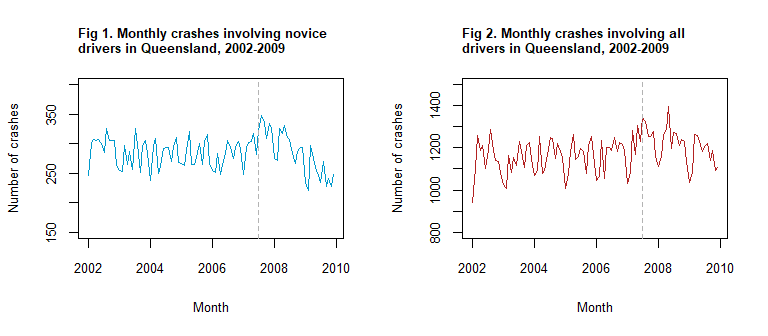
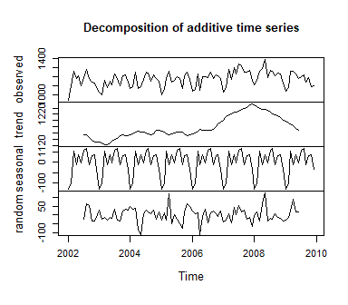
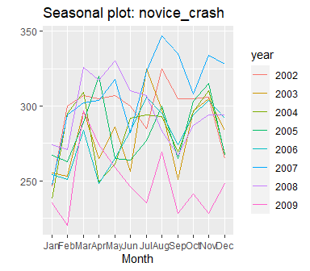
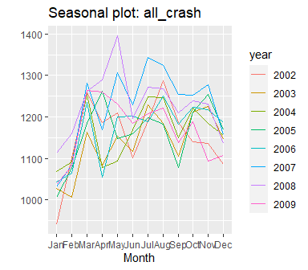
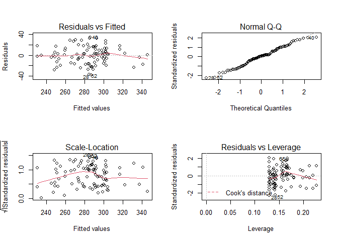
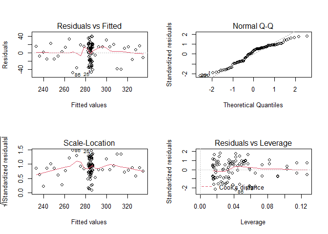
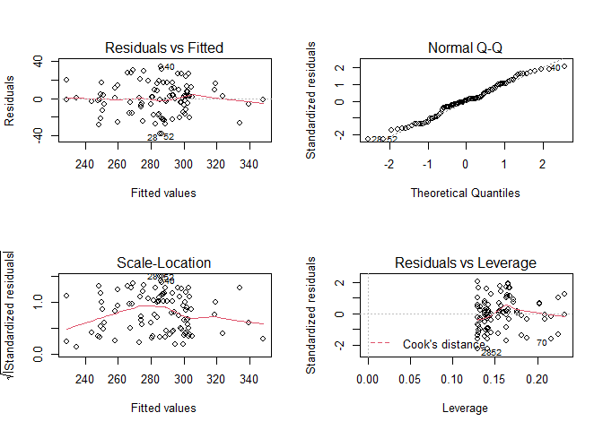
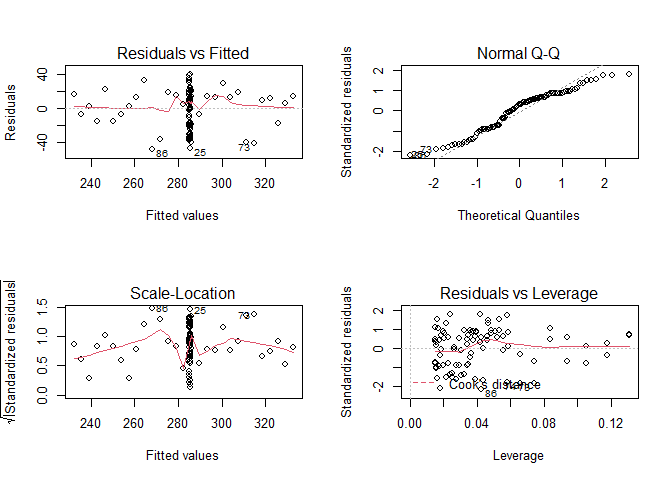
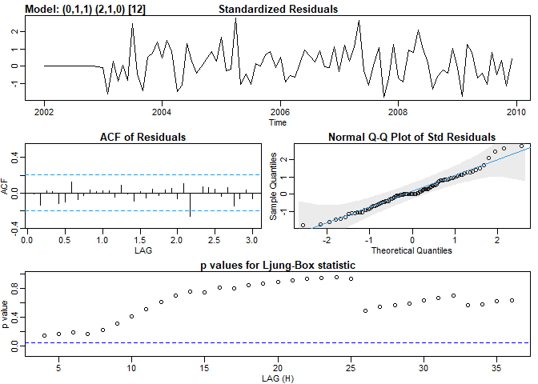

HDAT9700: Assignment 1B - Chapters 4 & 5
================

### Submission instructions

This is an R Markdown document—an example of *literate programming*, an
approach which allows users to interweave text, statistical output and
the code that produces that output.

To complete your assignment:

  - Edit this file directly, interweaving text and R code as appropriate
    to answer the questions below. Remember to `Knit` the file to make
    sure everything is running smoothly. Detailed information on R
    Markdown is available
    [here](https://rmarkdown.rstudio.com/lesson-1.html), and there is a
    useful cheatsheet
    [here](https://www.rstudio.com/wp-content/uploads/2015/02/rmarkdown-cheatsheet.pdf).

  - Use git to `commit` changes you make in this repo locally.

  - `Push` the repo, together with this edited file and the
    corresponding `.md` file to GitHub Classroom.  
    You can `commit` and `push` as often as necessary—your assessment
    will be graded on the most recent version of your repo at the
    assessment due date.

Good luck\!

-----

### Overview

For this assessment you will use a subset of data from a study of car
crashes after introduction of graduated driver licensing in Queensland
([Senserrick *et al*. Associations between graduated driver licensing
and road trauma reductions in a later licensing age jurisdiction:
Queensland, Australia. *PLoS ONE* 2018 Sep
25;13(9):e0204107](https://journals.plos.org/plosone/article?id=10.1371/journal.pone.0204107)).
This introduced increased restrictions on new (novice) drivers,
including introducing a 100-hour supervised driving requirement, as well
as restrictions on passenger carriage at night, use of high-powered
vehicles, and phone use. The purpose of this study was to quantify
changes in crashes involving novice drivers. The intervention was
implemented in July 2007. The data are monthly, from January 2002 to
December 2009.

The `crash.csv` file contains the following variables:

  - **month** - Month and year
  - **novice\_crash** - Number of crashes involving novice drivers
  - **total\_crash** - Total number of crashes

You may need to have the following packages installed: `astsa`,
`forecast`, and `zoo`.

The data are contained in your assignment repo in the file `crash.csv`
and can be read as follows:

``` r
library(readr)
crash <- read_csv('crash.csv')
```

-----

### Assessment questions

1)  Create a plot(s) of the number of crashes, both overall
    (*total\_crash*) and for novice drivers (*novice\_crash*), as if you
    were preparing it for inclusion in a report or publication. The date
    of the intervention should be clearly indicated. (15%)

<!-- -->

-----

2)  Describe the characteristics of both time series in terms of the
    trend, seasonality, and outliers. Use plots and summary statistics
    to support your statements. (10%)

<!-- --><!-- --><!-- --><!-- -->

**ANSWER:**

*Novice crashes:*

Overall, the median number of novice crashes per month was 291
(interquartile range, 265-305).

  - *Trend*: The number of crashes was relatively constant prior to
    mid-2006 or so, when it started to increase, and then decrease after
    2008. Looking at the seasonal plot, the number of crashes appears
    lowest in 2009, at the end of the series. It suggests that the
    change in crashes might best be described by a change in slope.

  - *Seasonality*: The number of crashes is lowest in January/February,
    but no other clear patterns are observed during the rest of the
    year. The median values in January and February were 251 and 267,
    while they were highest in November (median=306). Given this, it may
    be necessary to include seasonality in our regression models.

  - *Outliers*: Looking at the seasonal plot, February 2009 (220
    crashes) is lower than all other values. In contrast, observations
    in late 2007 are higher than expected. This is consistent with the
    trend data.

*All crashes:*

Overall, the median number of crashes for all drivers per month was 1186
(interquartile range, 1112-1232).

  - *Trend*: A very similar trend was observed for all crashes compared
    with novice crashes, however the number of all crashes appears to
    have been increasing slightly prior to the intervention, in contrast
    to novice crashes which appeared stable.

  - *Seasonality*: The number of crashes is lowest in January/February
    like with novice crashes. The median values in January and February
    were 1034 and 1082, while they were highest in March (median=1256).

  - *Outliers*: Looking at the seasonal plot, May 2008 is higher than
    all other values (1396 crashes), but doesn’t seem extreme enough to
    warrant further examination.

-----

3)  Create the necessary vectors to fit the regression models listed
    below. Here, `time` is the time since start of the study, `grad` is
    an indicator for the graduated licensing intervention (before=0,
    after=1), `time.after` is the time since the intervention, `month`
    is a monthly dummy variable, and `grad.lag1` and `time.after.lag1`
    are `grad` and `time.after` delayed/lagged by one month. State which
    model you believe best describes the association between the
    intervention, and the number of crashes involving novice drivers
    over time. Provide evidence to justify your answer. (25%)
    
      - **Model 1** - novice\_crash \~ time + grad + time.after + month
      - **Model 2** - novice\_crash \~ time + grad + time.after
      - **Model 3** - novice\_crash \~ time + grad.lag1 +
        time.after.lag1 + month
      - **Model 4** - novice\_crash \~ time + grad.lag1 +
        time.after.lag1

<!-- --><!-- --><!-- --><!-- -->

    ## 
    ##  Box-Ljung test
    ## 
    ## data:  model1$residuals
    ## X-squared = 9.0369, df = 12, p-value = 0.6998

    ## 
    ##  Box-Ljung test
    ## 
    ## data:  model2$residuals
    ## X-squared = 34.181, df = 12, p-value = 0.0006317

    ## 
    ##  Box-Ljung test
    ## 
    ## data:  model3$residuals
    ## X-squared = 6.2224, df = 12, p-value = 0.9045

    ## 
    ##  Box-Ljung test
    ## 
    ## data:  model4$residuals
    ## X-squared = 38.433, df = 12, p-value = 0.0001304

    ## [1] 841.1451

    ## [1] 875.2114

    ## [1] 842.7639

    ## [1] 878.0559

**ANSWER:**

There are several things to consider in choosing the “best” model.

  - First, we identified seasonality in Q2, meaning it is probably a
    good idea to include season in our model (as in Model 1 and Model
    3).
  - Looking at the residual plots, there is potentially some
    heteroscedasticity (non-constant variance) in the residuals for
    Models 2 and 4, as evidenced by the inconsistent spread around the
    red line in the “Residuals vs Fitted” plot and the “Scale-Location”
    plot. However, the residual plots for Models 1 and 3 look okay, with
    roughly normally distributed residuals (see QQ plot), relatively
    constant variance (see residuals vs fitted values plots), and no
    extreme values (see leverage plot).
  - However, the Ljung-Box test for autocorrelation of residuals has
    identified significant residual autocorrelation for Models 2 and 4
    (p\<0.05), but not for Models 1 and 3 (p\>0.05) meaning that Models
    2 and 4 are not great options.
  - Model 1 has the lowest AIC of all models (841.1451) suggesting it
    had the best fit.
  - The results for Models 1 and 3 are very similar and our conclusions
    won’t change based on which we choose.
  - Finally, given that we don’t have any compelling a priori reason to
    prefer either an immediate or delayed impact, Model 1 is the best
    option. It has a good fit as all the assumptions of linear
    regression are met (residuals are normally distributed with constant
    variance and no autocorrelation), it has the lowest AIC, and it
    adjusts for seasonality which we previously determined was a
    potential issue.

-----

4)  Using `auto.arima()`, identify the most appropriate ARIMA model
    orders for modelling the impact of the intervention on novice
    crashes, assuming an immediate (not delayed) impact. Think carefully
    about which parameters to pre-specify. State whether you would
    prefer the segmented regression model chosen in question (3), or
    this ARIMA model, and briefly justify your decision. (20%)

<!-- end list -->

    ## initial  value 3.472857 
    ## iter   2 value 3.226328
    ## iter   3 value 3.147069
    ## iter   4 value 3.003439
    ## iter   5 value 2.995101
    ## iter   6 value 2.989244
    ## iter   7 value 2.980100
    ## iter   8 value 2.979358
    ## iter   9 value 2.978998
    ## iter  10 value 2.978833
    ## iter  11 value 2.978831
    ## iter  11 value 2.978831
    ## iter  11 value 2.978831
    ## final  value 2.978831 
    ## converged
    ## initial  value 3.029304 
    ## iter   2 value 3.026177
    ## iter   3 value 3.026128
    ## iter   4 value 3.024916
    ## iter   5 value 3.024001
    ## iter   6 value 3.023728
    ## iter   7 value 3.023705
    ## iter   8 value 3.023705
    ## iter   8 value 3.023705
    ## iter   8 value 3.023705
    ## final  value 3.023705 
    ## converged

<!-- -->

**ANSWER:**

*Note: there are a few different possible approaches to this question.*

Given that the trend isn’t linear for the entire pre-intervention time
period (i.e. it starts increasing prior to July 2007), it is good idea
to include d=1. As the data are seasonal and d=1, we also specify D=1.
We will let `auto.arima` choose p, q, P and Q. \[*You could also say
that there is no pre-intervention trend (e.g. based on a stationarity
test of the data prior to the intervention) and specify d=0 and D=0.*\]

`auto.arima()` suggests (0,1,1)(2,1,0)<sub>12</sub>. \[*If the
`stepwise=FALSE` option is not specified, then `auto.arima()` gives
(0,1,1)(0,1,1)<sub>12</sub>. Both are acceptable.*\] Looking at the
residual plots for this model, it has a good fit with normally
distributed residuals (QQ plot) and no residual autocorrelation (based
on the ACF of residuals and Ljung-Box plot).

Given that the ARIMA model and segmented regression model give similar
results, and both fit the data well, I would prefer the segmented
regression model as it can estimate the pre-intervention trend. \[*Or,
you can say that you prefer the ARIMA model due to the changing trend
pre-intervention. Both are acceptable.*\]

-----

5)  Using the most appropriate model from question (3) or (4), describe
    the impact of the intervention on novice crashes. What is your
    conclusion about the effect of the intervention? Provide effect
    estimates and relevant statistics to support your answer. (15%)

**ANSWER:**

Prior to the intervention in July 2007, the number of novice driver
crashes in Queensland was constant over time with a slope of -0.1 per
month (95% CI -0.3 to 0.1). Immediately after the introduction of
graduated driver licensing, the number of crashes increased by a level
shift of 56.2 crashes (95% CI 40.2 to 72.2), and there was a change in
slope of -3.5 (95% CI -4.3 to -2.7). This means that after the
intervention crashes were decreasing by -3.6 (-0.1 + -3.5) per month.
Thus, the introduction of graduated licensing appears to have been
associated with a change in novice crashes in Queensland.

-----

6)  Including a negative control series is an interrupted time series
    analysis is one way of improving causal inference from interrupted
    time series analysis. Give an example of a negative control series
    and justify your selection, and explain how a negative control
    series can help with inference. (15%)

**ANSWER:**

An appropriate control would be novice drivers from a different
Australian state such as NSW that did not introduce graduated licensing
around this time. The negative control should be as similar as possible
to the population of interest, except that they were not targeted by or
exposed to the intervention. \[*There are other potential appropriate
negative controls that could have been chosen, as long as they were well
justified.*\]

One of the challenges of interrupted time series is that there may be
other confounding factors that led to a change in the number of novice
crashes, such as co-occurring interventions around the same time as the
introduction of graduated licensing (e.g. a driver safety awareness
campaign or similar), which may have been responsible for the change in
number of crashes. The first step for making use of a negative control
series is to evaluate whether there were any changes in this series at
the time of the introduction of graduated licensing in July 2007. If we
did observe a change in the control series that is similar in magnitude
to the change observed in the novice driver crashes, this tells that
there is something else causing the change, rather than the introduction
graduated licensing. Thus, we cannot say with certainty that the
observed changes were due to graduated licensing. On the other hand, if
we observed no change in the control series, this provides stronger
evidence that the change in the novice driver crashes was due to
graduated licensing.

-----
